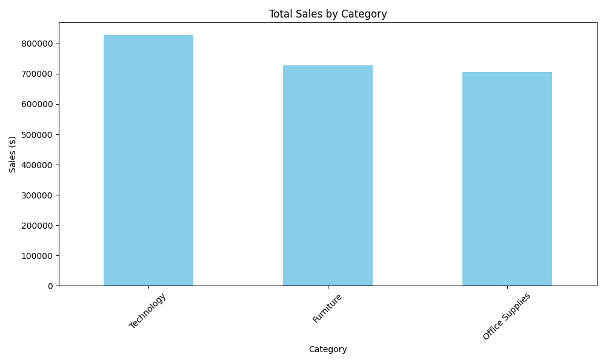
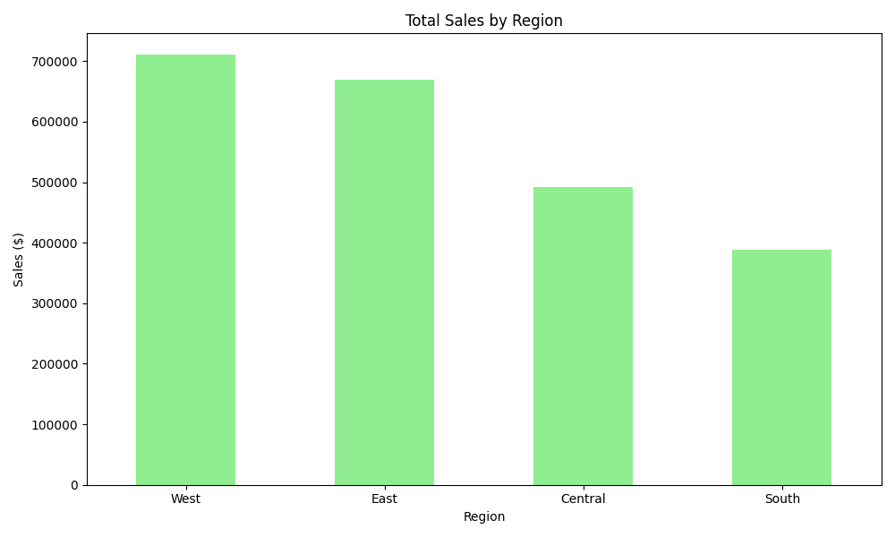
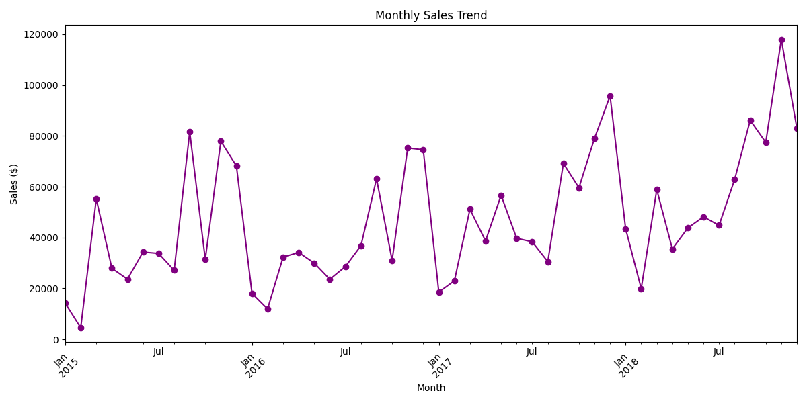

# Sales Data Dashboard

## Overview
This project is a Python-based Sales Data Dashboard that analyzes retail sales data to uncover trends by category, region, and month. It demonstrates my skills in data collection, cleaning, analysis, and visualization, aligning with requirements for a Jr Data Scientist role. The project was developed as part of my portfolio to showcase my abilities in Python, data analytics, and presenting actionable insights.

### Key Features
- **Data Source**: Retail sales dataset (`train.csv`) from Kaggle.
- **Tools Used**: Python, pandas, matplotlib.
- **Analysis**:
  - Total sales by category (e.g., Technology, Furniture, Office Supplies).
  - Total sales by region (e.g., West, East, Central, South).
  - Monthly sales trends over time.
- **Insights**: Found that Technology led with over $800,000 in sales, West was the top region, and sales showed seasonal patterns.
- **Visualizations**: Bar charts for category and region sales, and a line chart for monthly trends.

## Visualizations
Below are the visualizations generated by the project:

### Sales by Category


### Sales by Region


### Monthly Sales Trend


## How to Run
1. **Prerequisites**:
   - Python 3.x
   - Install required libraries:
     ```bash
     pip install pandas matplotlib